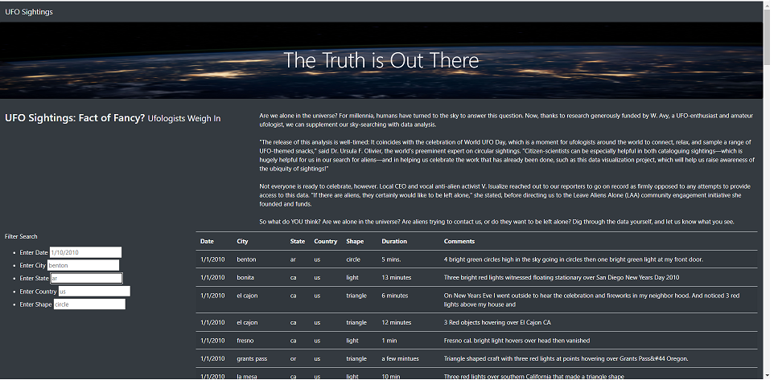
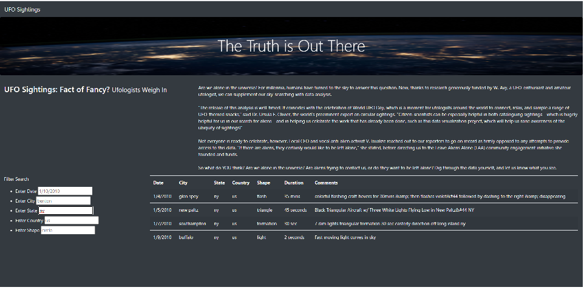

# UFO

## Overview of Project

The purpose of the website is to allow users to see the different accounts of UFO sightings in the US. This website allows users to filter these events by Date, City, State, Country, and Shape of the UFO. Currently this website only has data from Jan-1-2010 to Jan-13-2010. I added filters to allow users to view UFO data that interests them for specific location requests.

## Results
Someone interested in UFO sightings can come to this website and choose specific criteria to narrow down there search. They would first have the option to choose a specific date, then city, state, country, and shape. What is great about this website is that you don't need to fill in all the criteria in order to work. For example, below is the website with an unfiltered data table showing 118 sightings.

So if the user were interested in all sightings in New York, they would enter (ny) in the state filter to see there were four reported UFO sightings from January-1-2010 to January-13-2010 that you can see below:

## Summary

One serious drawback is that the data is pretty limited as it only shows dates from January-1-2010 to January-13-2010. As far as further improvement, I would recommend a larger data set, and if possible another column with links to those specific encounter references. As the next step for users might be to view that information. In order to keep them on the site, ideally it would be able to generate in a second table below. Additionally I would change the filters to be more user friendly. For example, the choices for state and city should be drop down as users might mistype or not realize that states are derived by 2 letters instead of the whole spelling. For calendar, a similar issue of user error could occur, and might be best to allow them to click on a pop-up calendar for more accuracy, but that is nitpicking it.
